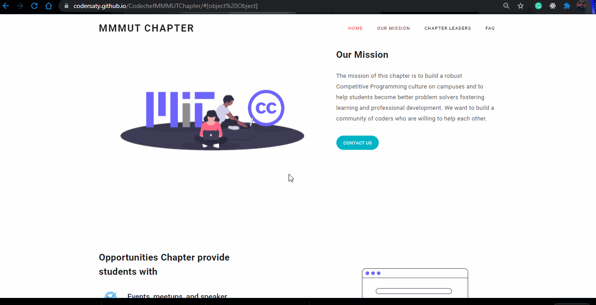

<h1 align="center" id="top">Welcome to Codechef MMMUT Chapter👋</h1>

# Basic Overview

> This project is developed as a simple static website for coding club of the college [CODECHEF MMMUT CHAPTER](https://codersaty.github.io/CodechefMMMUTChapter).
 

# Table of Contents

- [Description](#description)
- [Technologies Used](#technologies)
- [License](#license)
- [Related Projects](#related-projects)
- [Author Info](#author-info)

 

# Description

This project is developed as a simple static website for coding club of the college [CODECHEF MMMUT CHAPTER](https://codersaty.github.io/CodechefMMMUTChapter) using Bootstrap template.

[Live Demo](https://codersaty.github.io/CodechefMMMUTChapter/)

 

# Technologies

- [HTML5](https://en.wikipedia.org/wiki/HTML5)
- [CSS3](https://en.wikipedia.org/wiki/CSS)
- [JavaScript](https://en.wikipedia.org/wiki/JavaScript)
- [Git](https://en.wikipedia.org/wiki/Git)
- [Markdown](https://en.wikipedia.org/wiki/Markdown)
- [Bootstrap](https://en.wikipedia.org/wiki/Bootstrap_(front-end_framework))

### Tools used

- [VS Code](https://en.wikipedia.org/wiki/Visual_Studio_Code)
- [Github](https://en.wikipedia.org/wiki/GitHub)

 

# License

[MIT License](LICENSE.md)

Copyright (c) 2021 @[codersaty](http://codersaty.github.io/Portfolio)

 

# Related Projects

- Level Zero Portfolio [Live Demo](https://codersaty.netlify.app/) [Github](https://github.com/CoderSaty/LevelZeroPortfolio)

 

# Author Info

- Twitter - [@codersaty](https://twitter.com/codersaty)
- Website - [Anuranjan Srivastava](http://codersaty.github.io/Portfolio)
- Linkedin - [codersaty](https://www.linkedin.com/in/codersaty)

 

[Back To The Top](#top)
